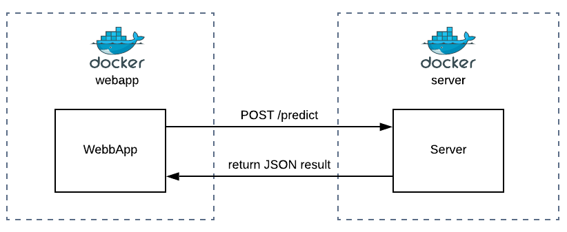
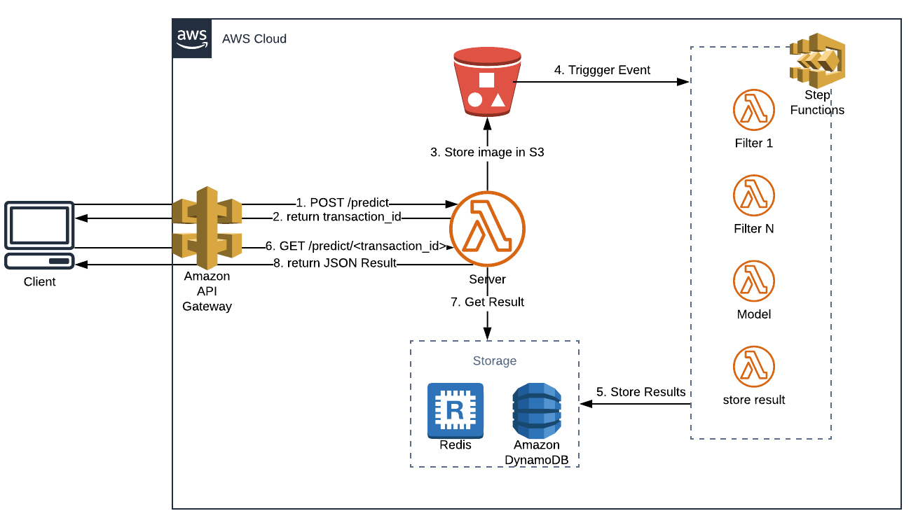

# Documentation

## Architecture

### Current Development Architecture

This is the current Architecture for development.
Webapp and Server are running in Docker containers and current API has one endpoint to start a prediction through an image submission.

For more information about how to run dev environment: [Developer Information](/README/DEVELOPERS.md).

### Production architecture

This the proposed architecture to be deployed in `AWS`. Additionally, this proposal contains an approach for the complete flow to submit and get the results in a scalable solution, using batch processing for images.

This approach includes the following services:

1. `S3` to store images and trigger an event to start the prediction process.
2. `AWS Step functions` to orchestrate the prediction process: image pre-processing, run prediction model, and store results.
3. `Redis` is an in-memory database this allows faster results search.
4. `DynamoDB` is going to store User information and persist prediction results.
